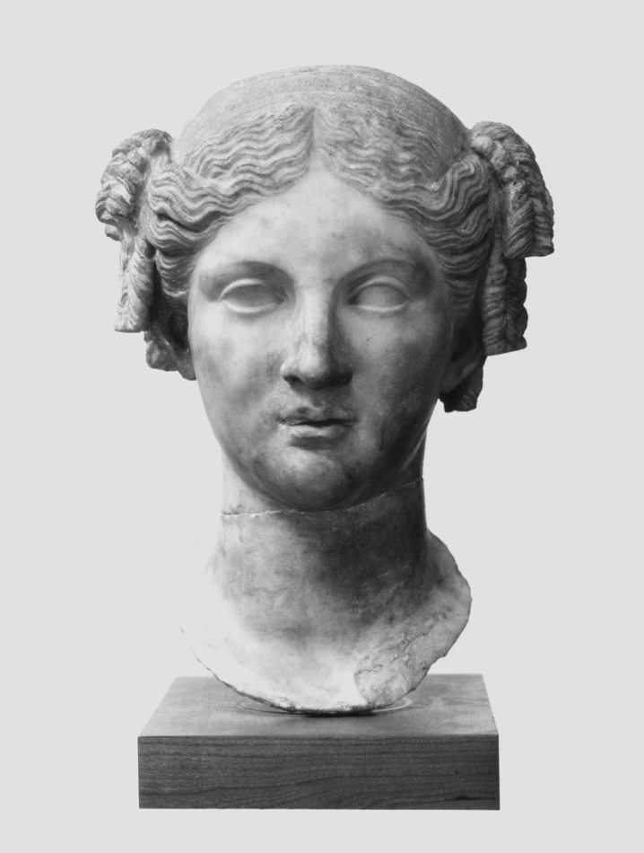
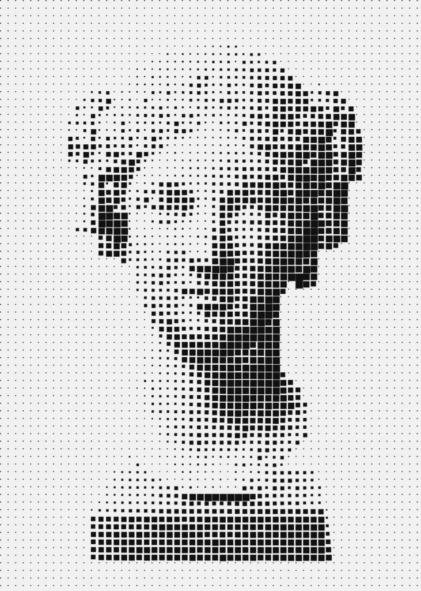

# How to rasterize an image with Processing

この投稿では，画像のデータにアクセスする方法と，それを使っておしゃれなカスタム画像フィルタを作成する方法を紹介します．

私([Tim Rodenbröker](https://timrodenbroeker.de/about/) さん)はProcessingで画像データにアクセスする方法を示す方法として[ラスタライズ](https://w.wiki/6GPx)を選択しました．結局のところ，あらゆる種類の画像で創造性を発揮するための何百万もの可能性のうちの一つに過ぎないのです．このページの下に，インスピレーションを得るための素晴らしいプロジェクトがいくつかリストアップされています．




このチュートリアルでは，いくつかの非常に重要なトピックを扱います．多次元配列のループ処理から，色値の変換，グリッドの再計算まで．

さあ，はじめましょう．

# Setting up the sketch

いつものように，基本的な設定からはじめます． `setup()` メソッドの前に2つの色を定義し，データフォルダから画像をロードするプログラムです[^1]．

```Processing
color FG = #111111;
color BG = #f1f1f1;

PImage img;

void setup() {
  size(500, 700);
  background(BG);
  img = loadImage("woman.jpg");
}

void draw() {
  background(BG);
  fill(FG);
  noStroke();
}
```

> この時点で実行結果は以下のように何も表示されません．プログラムとしては，画像データを読み込んでいるだけキャンバスには表示していません．


## The rasterization-algorithm

今回使用する画像(718 x 950)は，キャンバスのサイズ(500 x 700)と若干異なっています．そのため，`setup()` で `resize()` 関数を使用しています[^2]．

```Processing
img.resize(500, 700);
```

これから `draw()` ループの中にラスタライズアルゴリズムを作成していきます．グリッドのすべてのタイルの幅と高さは等しいので，画像のアスペクト比を計算します．これによって，縦方向にいくつタイルが必要かがわかります．

```Processing
void draw() {
    ...
    float ratio = float(height)/flaot(width);
}
```
次に，X軸のタイルの数をマウスのX座標にバインドさせます[^3]．これにより，様々な解像度をテストすることができます．

```Processing
void draw() {
    ...
    float ratio = float(height)/flaot(width);
    float tilesX = map(mouseX, 0, width, 10, 100);
}
```

そして，画像のアスペクト比に基づいてY軸のタイル数を計算します．

```Processing
void draw() {
    ...
    float ratio = float(height)/flaot(width);
    float tilesX = map(mouseX, 0, width, 10, 100);
    float tilesY = ratio * tilesX;
}
```

最後に，各タイルの幅と高さを計算する必要があります．今回は，正方形のタイルを使って作業することを目指しているので，この計算は一度だけで実行します．

```Processing
void draw() {
    ...
    float ratio = float(height)/flaot(width);
    float tilesX = map(mouseX, 0, width, 10, 100);
    float tilesY = ratio * tilesX;
    float tileSize = width / tilesX;
}
```


[^1]: Processingで画像を扱うには，https://yoppa.org/proga10/1353.html を参考にしてください．

[^2]: `resize()` 関数については，https://processing.org/reference/PImage_resize_.html を参考にしてください．

[^3]: `map()` 関数については，https://processing.org/reference/map_.html を参考にしてください．